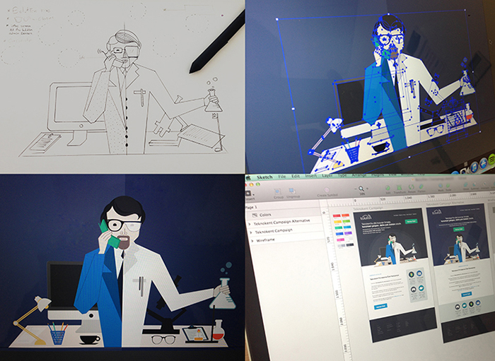
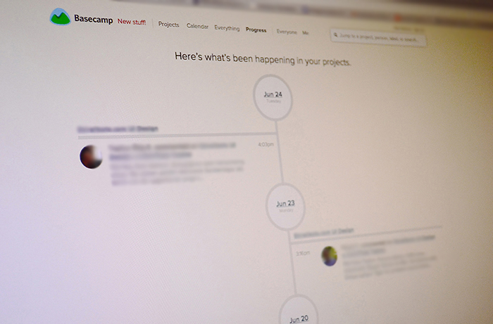
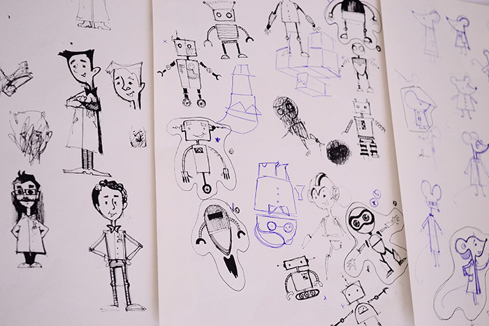
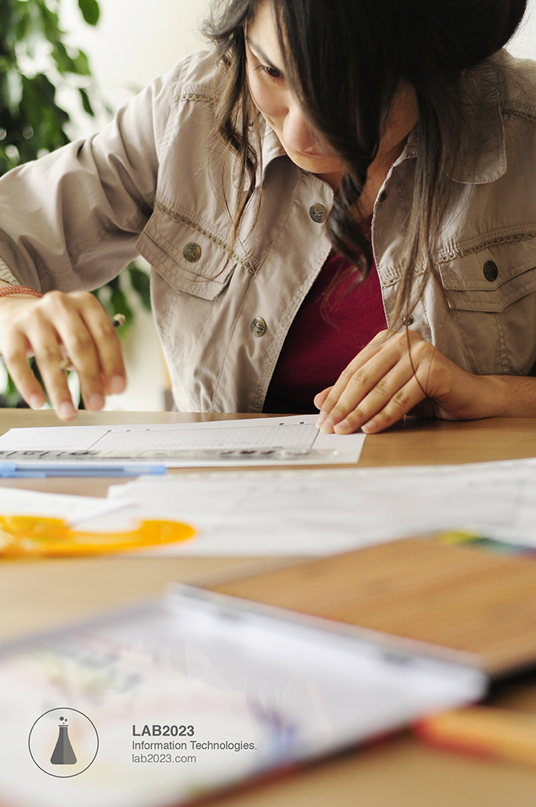
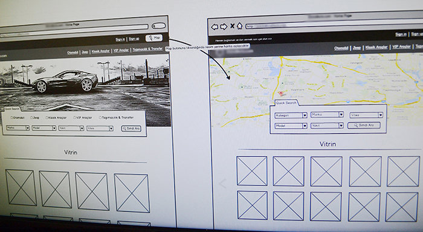
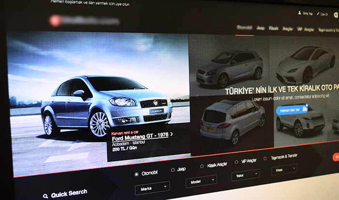
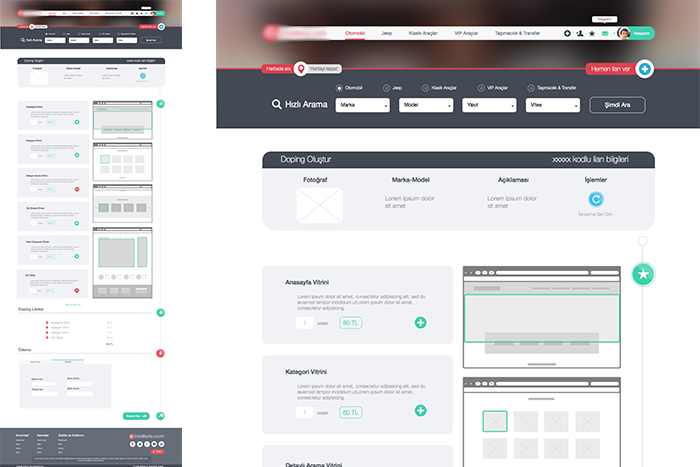

### 1. Understanding client needs 

After every dealing process our first task is define the main requirements we need to develop in an specific time period, for specify these features is necessary to focus in understand the main needs our design should supply. Realize about client perspective give us the key for success in a final result.

### 2. Brainstorming

Once we understand our main goal the next step is to look for inspiration, creative and suitable solution we can develop. In this way there are many ways for exercise our imagination, sketching our new ideas is a very good way for make feedback process inside the team, discuss and decide the best option.

### 3. Conceptualize

Conceptualize it's the process in which all the team get synchronize in a main idea, in design concepts we define how the semantic idea will be present in all perceptual aspects, here we define main characteristics, style, colors, typography, shapes, diagramming grid and structure for compose.

### 4. Prototype

In web design prototype digital files are known as mockups or wireframes, these are a preview without details of what should be a final result, this process save a lot of time in design projects, we prevent future failures keeping a constant dialog with the customer about design progress. We save more time doing this process digital with tools like [Balsamiq](http://lab2023.com/balsamiq-uygulamasi-ile-web-arayuzu-tasarimi.html).

### 5. Evaluation

For improve times and have a more assertive final design, we keep a constant communication with customer, let them now about last features, last changes and achieve their approval for start every final design-process.

### 6. Design

This is the moment for join all the pieces, we call design to all the process we make for achieve this step.

### 7. Improve

Finish a design project its the start point for improve, make an inside about the topics we can do better for next projects it's an important part of the design-process.

