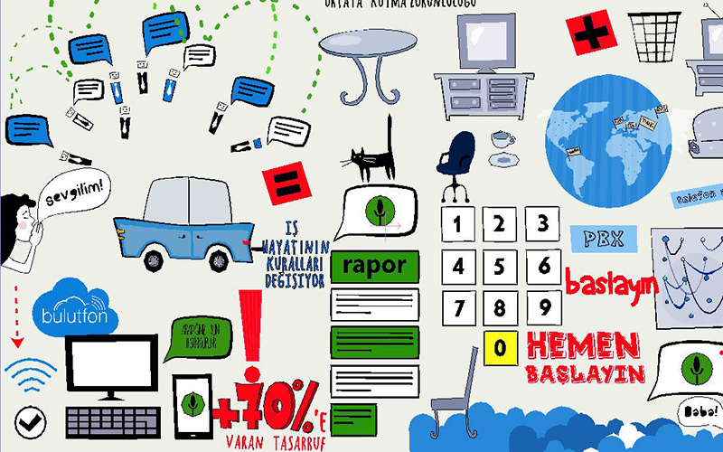

En este artículo trataré de realizar una corta explicación sobre el proceso de creacion de la animación.

1. paso es crear la historia...
2. paso es crear un personaje principal...
3. paso es crear un storyboard...
4. paso es crear un personaje principal que funcione a través de huesos en el programa de animación...
5. paso es crear todos los objetos que necesitaremos en la animación...
6. paso es realizar la animación...
7. paso es realizar los efectos de sonido...
8. paso es realizar la musica de fondo...
9. paso es aplicar el proceso de montaje...

### 1. paso es crear la historia...

Esta historia cuenta sobre los productos de Bulutfon, explicando todas las oportunidades que Bulutfon proporciona a sus clientes, ofreciendo cómodos servicios, para hacer el emprendimiento de negocios mucho más facil.

### 2. paso es crear un personaje principal...

Despues de crear la historia lo siguiente mas importante es crear un personaje principal. Creamos este personaje con la idea en la mente de un joven hombre de negocios, muy sincero, energético, con una sonrisa simpático y ojos amables. Lo hicimos muy cercano a la realidad, con proporciones humanas.

### 3. paso es crear un storyboard...

Despues de tener la historia y el personaje principal listos, fuimos al siguiente paso, uno de los más importantes, crear el story board. El storyboard no tenia muchos detalles, solo plasmamos la idea principal de cada frase de la historia. Lo realizamos como un pequeña descripción de la animación para cada escena, para hacer a las personas entender nuestro producto y la misión de nuestro producto, pusimos muchas notas en las márgenes (flechas que mostraban de donde a donde nuestro personaje debía moverse, asi como tambien muchos comentarios que nos ayudaran a no perder una sola idea), el resultado fue:

### 4. paso es crear un personaje principal que funcione a través de huesos en el programa de animación...

Despues de que el storyboard esta completamente listo con todas las correcciones necesarias, continuamos al siguiente paso, que es crear los huesos del personaje principal. Lo creamos con puntos con todas las funciones necesarias para animarlo. Por ejemplo, dibujamos varios tipos de bocas y ojos, para darle la oportunidad de hablar, parpadear y cambiar la expresión de sus ojos, de normal a sorprendido o tristes, etc. tambien el caracter puedes estirar y aplastar, mover sus piernas, brazos, cabeza, cejas y la corbata.

### 5. paso es crear todos los objetos que necesitaremos en la animación...

Preparamos todos los elementos que vamos a usar en nuestra animación. Para algunos objetos creamos también huesos para generar animación en ellos. Escogimos los colores principales muy abiertos como por ejemplo amarillo, verde, rojo, azul mezclado con un gris suave.

### 6. paso es realizar la animación...

El paso más importante es realizar la animación de los personajes por la manipulación de huesos. Tratamos de hacerlo plástico y cómico, muy vivido y adorable. Para hacer la animación más realista estuvimos usando las leyes de walt disney.
Aqui un pequeño resumen con los principios básicos para realizar animación digital.

 [Principios básicos de la animación](http://www.youtube.com/watch?v=l-KtwW6eptM )

Cada escena fue renderizada y guardada en carpetas diferentes.

Este es nuestro resultado:

### 7. paso es realizar los efectos de sonido...

Estamos usando muchos efectos de sonido en la animación, es necesario. Brinda acentos en cada movimiento, demuestra peso en los objetos que caen, demuestra peso en el caminar del personaje etc.

### 8. paso es realizar la musica de fondo...

La música de fondo es solo para el acompañamiento de la animación. Todo el tono depende de la musicalización de fondo. El ritmo de la animación y el ritmo de la música deben trabajar sincronizados para finalizar una escena. Escogimos una melodía energética y muy graciosa.

### 9. paso es aplicar el proceso de montaje...

Cuando tenemos la música de fondo y tenemos todos los archivos de la animación completos y los efectos de sonido mezclados, solo necesitamos realizar un último paso, que es el montaje final uniendo todas la piezas en un solo video.

Ahora despues de todo el trabajo realizado podemos observar nuestro resultado final:

[Como creamos la animación de Bulutfon](http://vimeo.com/102756655)

...y tambien lo compartimos en dribbble

[Encuentra esta animación en Dribbble](https://dribbble.com/shots/1676198-Bulutfon-Animation)

Gracias por su atención.