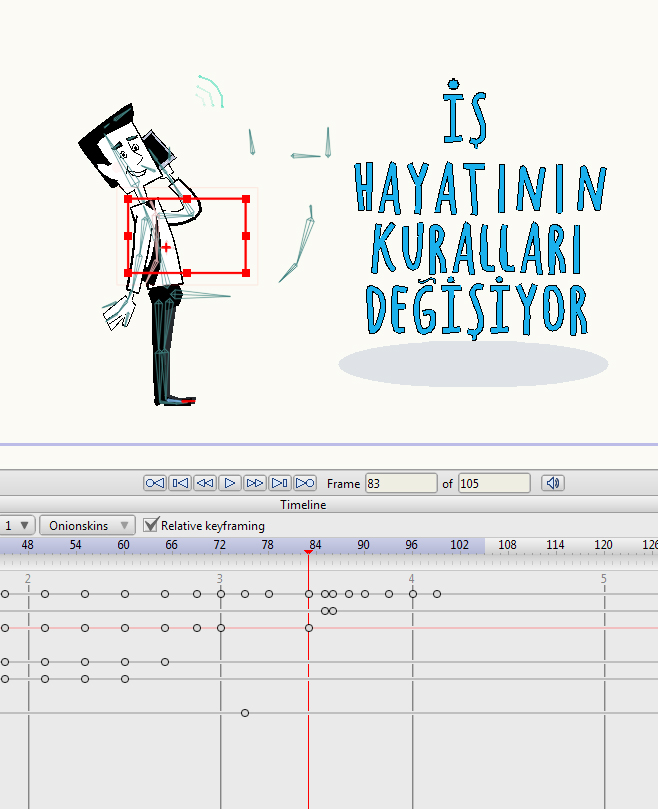

Bu makalede, animasyon oluşturma ile ilgili kısaca bilgi vermeye çalışacağım.

1. adım, bir hikaye oluşturulması...
2. adım, bir ana karakter oluşturulması...
3. adım, bir hikaye panosu oluşturulması...
4. adım, Ana karakterin bir kukla olarak, iskeletiyle birlikte animasyon programında oluşturulması...
5. adım, Animasyon için gerekli olan tüm nesnelerin oluşturulması...
6. adım, bir animasyon oluşturulması...
7. adım, ses efektlerinin oluşturulması...
8. adım, arka plan müziğinin oluşturulması...
9. adım birleştirme işlemlerinin uygulanması...

### 1. Bir hikaye oluşturduğumuz adımdır...

Bu hikaye bize Bulutfon ürünüyle birlikte iş kurmayı kolaylaştırmak için, Bulutfon'un müşterilere sunduğu tüm fırsatları anlattığı, çok rahat servisleri sunduğundan bahsediliyor.

### 2. Bir ana karakter oluşturduğumuz adımdır...

Hikayeyi oluşturduktan sonra, ana karakteri oluşturmak sonraki önemli adımdır. Bu karakteri aklımızdaki fikir ile birlikte, çok samimi, zeki, enerjik, iyi gülen ve nazik gözlere sahip genç bir iş adamına ihtiyacımız olduğundan oluşturuyoruz. İnsan özellikleri ile gerçeğe çok yakın karakter oluşturduk. 

### 3. Bir hikaye panosu oluşturduğumuz adımdır...

Hikayeyi belirleyip ana karakter hazır olduktan sonra, bir sonraki çok önemli adıma, hikaye panosu oluşturduğumuz adıma gittik. Hikaye panosunu çok fazla detaylandırmadan oluşturuyoruz. Sadece hikayenin her cümlesindeki ana düşünce belirtilir. Bunun her bir sahnesini kısa animasyonlu anlatım gibi, insanların ürünümüzü ve ürünüzmüzdeki misyonu anlamaları için oluşturuyoruz. Kenar boşluklarına yeterince notlar ekliyoruz(oklar, karakterimizin nereden nereye taşınacağını bize gösterir ve ayrıca sahnenin ana fikrini kaybetmememize yardımcı olmak için her sahne için yeterince yorumlar ekledik.) Sonuçta:

### 4. Ana karakteri bir kukla olarak, iskeletiyle birlikte animasyon programında oluşturduğumuz adımdır...

Hikaye panosu yapılan tüm düzenlemelerle hazır olduktan sonra, bir sonraki adım olan bir kukla olarak ana karakteri oluşturmaktır. Onu animasyon için ihtiyaç duyabileceğimiz bir iskelet ve tüm fonksiyonlar ile birlikte oluşturuyoruz. Örnek olarak, ağız ve gözlerini bir çok tipte çizdik, konuşması için fısat verilir, gözlerini kırpması ve göz durumunu değiştirmesi, normal bir durumdan süpriz durumuna veya normalden üzgün moduna ...vs. Ayrıca çizgi film karakteri olarak ezilmiş veya gergin olabilir. Ayaklarını ve ellerini hareket ettirebilmeli, başı, kaşları, bağı bile canlandırılmış olabilir.   

### 5. Animasyon için gerekli olan tüm nesneleri oluşturduğumuz adımdır...

Animasyonda kullanacağımız bütün öğeleri oluşturduk. Bazı öğeler için ayrıca kemikler oluşturduk, çünkü onlarda onlarında canlandırılması gerekir ayrıca. Ana renkleri çok açık, sarı, yeşil, mavi, kırmızı gibi renklerle ve çok açık gri ile karıştırmış olarak seçiyoruz.    

### 6. Animasyonu oluşturduğumuz adımdır.

Karakterlerin animasyonunu iskelet ile manipule etmek en önemli adımdır. Onları plastik ve komik yapmaya çalışmak, çok hayatdolu ve şirindir. Daha gerçekçi animasyonlar yapmak için, Walt Disney' in geliştirdiği kuralları kullandık.
Animasyon yapmanın ana prensipleri ile çok kısa göz gezdirebileceğiniz video burdadır:

 [Main principles of making animation ](http://www.youtube.com/watch?v=l-KtwW6eptM )
 
 Her bir sahneyi bir klasörün içinde farkli dosyalar olarak oluşturup kaydettik. 
 
 

Sonuç olarak aldığımız:

### 7. Ses efektleri oluşturduğumuz adımdır.

Animasyonda bir çok ses efekti kullandık. Ses efektleri hareketlerdeki aksanı bize verir, düşen bir nesnenin ağırlığını, yürüyen bir adamın ağırlığı vs 

### 8. Arka plan müziği oluşturduğumuz adımdır.

Arka plan müziği sadece animasyon ile birlikte kullanılmak içindir. Tüm modlar arka plan muziğine göre değişir. Animasyon ritmi ve müzik ritmi tüm sahneler bittiğinde eşzamanlı olarak çalışmak zorundadır. Animasyon ritmine ve ana karakterin doğasına göre enerjik ve çok eğlenceli müzik seçtik. Böylece tümü birlikte bir sistem olarak mükemmel bir şekilde çalışır. 

### 9. Birleştirme işlemlerinin yapıldığı adımdır.

Arka plan müziğini seçtiğimiz zaman ve tüm animasyon dosyaları bittiğinde ve tüm ses efektleri tamamlandığında, sadece son bir adıma ihtiyacımız olur, buda tüm dosyaları tek bir video dosyası altında birleştirmek.

Şimdi tüm çalışmalar yapıldıktan sonra, final animasyonunu görebiliriz: 

 [How we created Bulutfon animation](http://vimeo.com/102756655)

...ve Dribble' da paylaşılmıştır.

 [Bulutfon animation on dribbble](https://dribbble.com/shots/1676198-Bulutfon-Animation)

İlginiz için teşekkür ederim .

