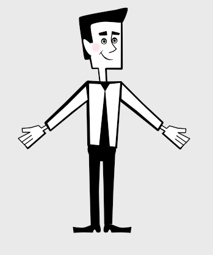
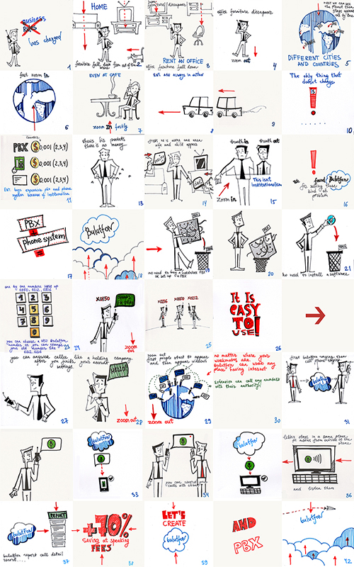

In this article I will try to give a short explanation about creating an animation.

1. step is creating a story...
2. step is creating a main character...
3. step is creating a storyboard...
4. step is creating main character as a marionette, with bones in an animation program...
5. step is creating all the objects that we will need in the animation...
6. step is making an animation...
7. step is making sound effects...
8. step is making a background music...
9. step is applying the merging process...

### 1. step is creating a story...

This story is telling us about Bulutfon products, explaining all the opportunities that Bulutfon gives to customers, offering very comfortable services, to make business foundation easier.

### 2. step is creating a main character...

After creating the story the next important step is creating a main character. We created this personage with the idea in mind, that we need a young businessman, very sincere, smart, energetic, with the nice smile and kind eyes. We made him very close to the reality, with human proportions.

### 3. step is creating a storyboard...

After knowing that the story and with main character ready, we went to the next, very important step, which is creating the storyboard. We made the storyboard without too much detail, just put the main idea of each sentence of the story. We made it like a short animated description to every single scene, to make people understand our product and the mission of our product. We put a lot of notes in the margins (arrows, which show us from where to where our character is moving and also a lot of comments for the each scene, to help us not to lose the idea of the scene). The result is:

### 4. step is creating main character as a marionette, with bones in an animation program...

After storyboard is totally ready with all the corrections that were made, we went to the next step, which is creating the main character as a marionette. We created him with bones and all functions, that we will need, to animate him. For example, we drew several types of mouth and eyes, to give him opportunity to speak and blink and change his eyes' expression, from normal to surprised or from normal to sad etc. Also as a cartoon’s character he can be squashed and stretched, he can move his legs and hands, his head, his eyebrows, even his tie can be animated.

### 5. step is creating all the objects that we will need in the animation...

We prepared all the elements, that we will use in our animation. For some elements we also created bones, because we will animate them also. We chose main colors very open, like yellow, green, red, blue, which are mixed with very soft grey.

### 6. step is making an animation...
The most important step is making animation of characters by manipulating bones. We tried to make them plastic, comic, very lifeful and adorable. For making animation more realistic we were using rules, that Walt Disney developed.
Here is a very short review with the main principles of making animation:

 [Main principles of making animation ](http://www.youtube.com/watch?v=l-KtwW6eptM )

Every single scene we rendered and saved in a folder as a separate file.

This is what we got as a result:

### 7. step is making sound effects...

We were using a lot of sound effects in the animation. It is necessary. It gives accents into a movement, it gives weight to a falling object, it gives weight to walking men etc.

### 8. step is making background music...

Background music is just like an accompaniment to the animation. The whole mood depends on the background music. The animation rhythm and music rhythm have to work synchronously to make all scene finished. We chose energetic and very funny music according the rhythm of the animation and the nature of the main character. So all together they work great as a system.

### 9. step is applying the merging process...

When we have background music and when we have all the animation files finished and all sound effects completed, we just need to make a final step, which is merge all of the files to one video file.

Now after all of the work that have been made, we can see final animation:

 [How we created Bulutfon animation](http://vimeo.com/102756655)

...and we have shared to Dribbble

 [Bulutfon animation on dribbble](https://dribbble.com/shots/1676198-Bulutfon-Animation)

Thank you for your attention.
